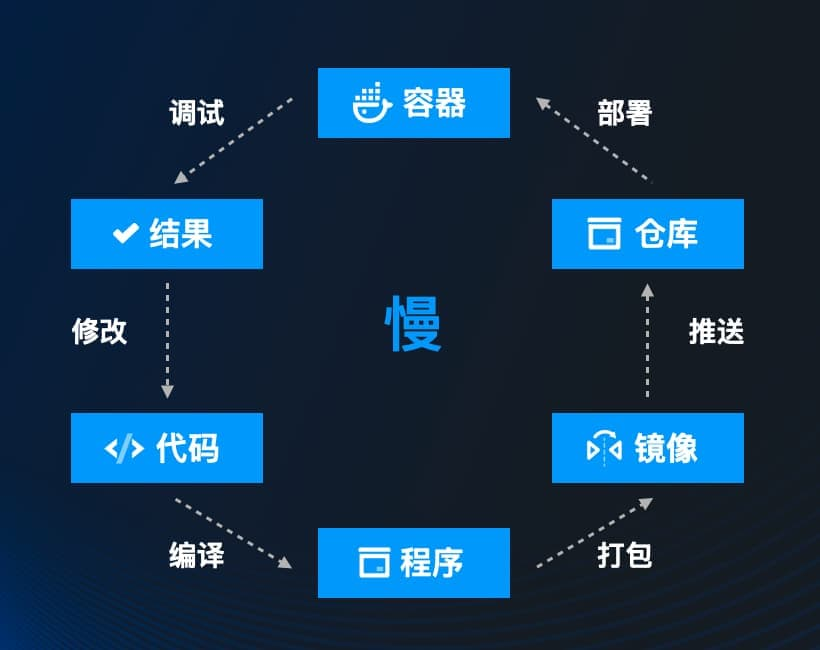
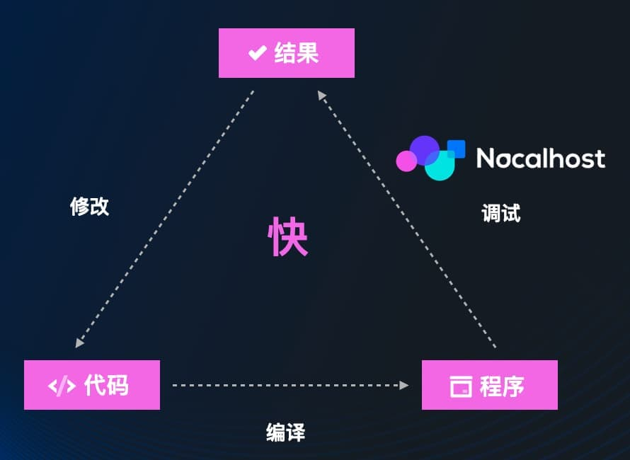
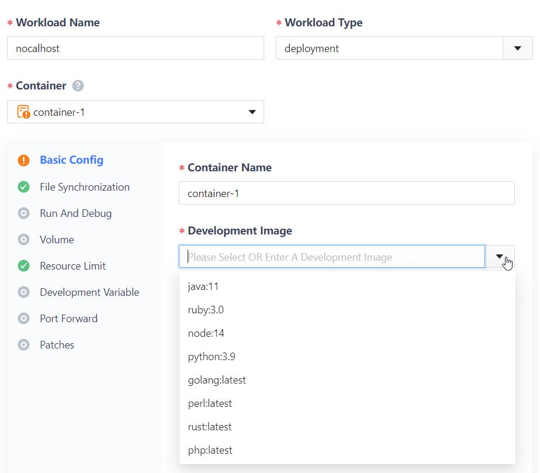

+++
title = '使用 Nocalhost VSCode 插件调试 k8s 服务'
date = 2022-01-10
+++

Nocalhost 目前支持 Jetbrains 全系列插件的一键调试。随着 Nocalhost v0.6.9 发布，VSCode 一键调试已支持 `Go`、`Python`、`Node.js`、`Java`、`Ruby`、`PHP` 。

### 传统调试

远程调试（Remote Debug）一直都是排查问题的重要手段，但在 k8s 环境里调试服务并不是一件简单的事情。传统调试服务都需要以下步骤：

1. 修改镜像（用 Debug 调试器启动的开发镜像）。
2. `kubectl port-forward` 转发调试端口到本地。
3. 配置 IDE 连接到调试端口。

调试过程中，每次代码修改到反馈大致需要5分钟（CI/CD)， 调试相对麻烦、编码循环反馈慢、体验不佳。



### Nocalhost 调试

使用 Nocalhost 只需简单配置，即可一键启动 Debug ，代码实时同步远端容器，做到**秒级**编码反馈，大幅提升云原生行业开发效率。



#### 原理

当我们使用 Nocalhost 调试时，VSCode 插件会首先进入 `DevMode`模式，执行以下操作：

1. 将工作负载的副本数缩减为1。为了在通过`Service`访问时只访问我们正在开发的应用程序，我们需要缩减副本数为1。

2. 替换容器的镜像为开发镜像。

3. 增加一个 sidecar 容器。在我们编辑的代码时希望更改的代码能快速更新到工作负载中，于是我们增加了 sidecar 来实现代码的同步。

在进入 `DevMode` 后，插件会执行以下操作：

1. 在工作负载中执行 debug 命令，启动应用及调试器。
2. 自动将远程调试端口转发至本地随机端口。
3. 通过调试协议连接调试端口检测调试器是否就绪。
4. 等待调试器就绪后，插件会自动连接调试端口开始调试。

> 当使用Nocalhost 开发镜像时 VSCode 插件会自动识别开发语言，启动对应的调试器进行调试。
>
> 如果我们自定义了开发镜像，启动`Remote Debug`时需根据提示选择对应的开发语言。

### 使用步骤

#### 前置准备

- 准备一个可用的 Kubernetes 集群
- VSCode 1.58+
- 安装 Nocalhost VSCode 插件

#### 配置

在调试之前，我们点击需要调试的工作负载右边的 ⚙️ ，进行Debug配置。

```yaml
 containers:
 - name: authors
    dev:
      image: nocalhost-docker.pkg.coding.net/nocalhost/dev-images/golang:latest
      command:
        debug:
          - ./debug.sh
      debug:
        remoteDebugPort: 9009
      ...
```

配置说明：

- `dev.image`：开发镜像，远程调试依赖容器中调试器（如 go的Delve、Python 的 debugpy、Ruby 的 ruby-debug-ide、PHP 的 xdebug），所以在调试前需要替换容器镜像为带有调试器的开发镜像。Nocalhost 提供以下镜像,并提供[源码](https://github.com/nocalhost/dev-container),并提供在线配置工具 [Tools](https://nocalhost.dev/tools/)。

  


- `dev.debug.remoteDebugPort`：调试器端口，调试会对端口执行端口转发，以便连接调试器。

- `dev.command.debug`：debug 启动命令，需按照您使用的语言调试器进行配置,并且调试器端口需与`dev.debug.remoteDebugPort`保持一致，各语言调试器配置如下：
  - Node.js 使用 `--inspect=<remoteDebugPort>` 启动 Node.js 应用。
  - Python 使用 `debugpy` 启动 Python 应用。
  - Go 使用 `dlv debug`启动 Go 应用。
  - Java 使用`-agentlib:jdwp=transport=dt_socket,server=y,suspend=n,remoteDebugPort=,quiet=y`选项来启动 Java应用。
  - Ruby 使用`rdebug-ide`启动Ruby应用。
  - PHP 使用`xdebug`实现远程调试，启动命令无需更改。

debug 启动示例：

```shell
# node
node --inspect=<remoteDebugPort> index.js

# go
dlv debug --headless --log --listen :<remoteDebugPort> app.go

# java
java -agentlib:jdwp=transport=dt_socket,server=y,suspend=n,address=<remoteDebugPort>,quiet=y -jar app.jar

# ruby
rdebug-ide -h 0.0.0.0 -p <remoteDebugPort> -- app.rb

# python
python -m debugpy --listen <remoteDebugPort> --wait-for-client app.py
```

> 为了能快速体验远程调试，您也可以在插件上选择ns点击🚀在弹出框中选择 `Deploy Demo`安装 `Demo`应用，安装完成后，即可选择要调试的服务直接开始远程调试。

#### 开始调试

右键点击 `Remote Debug`，选择源码目录后开始等待调试器就绪。(首次使用会自动安装依赖插件,需重启后再次点击 `Remote Debug`开始远程调试)。


调试启动后会生成 Nocalhost Debug 配置，后续可直接通过 `VSCode Debug` 直接启动远程调试。